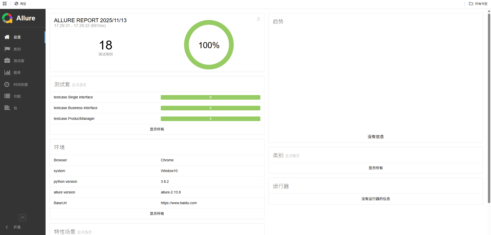
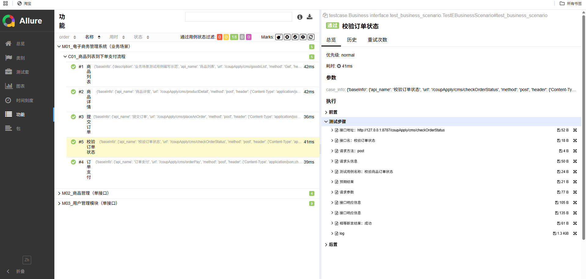
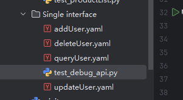
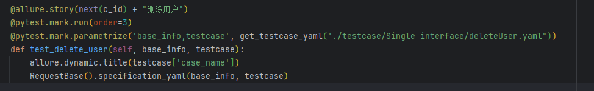
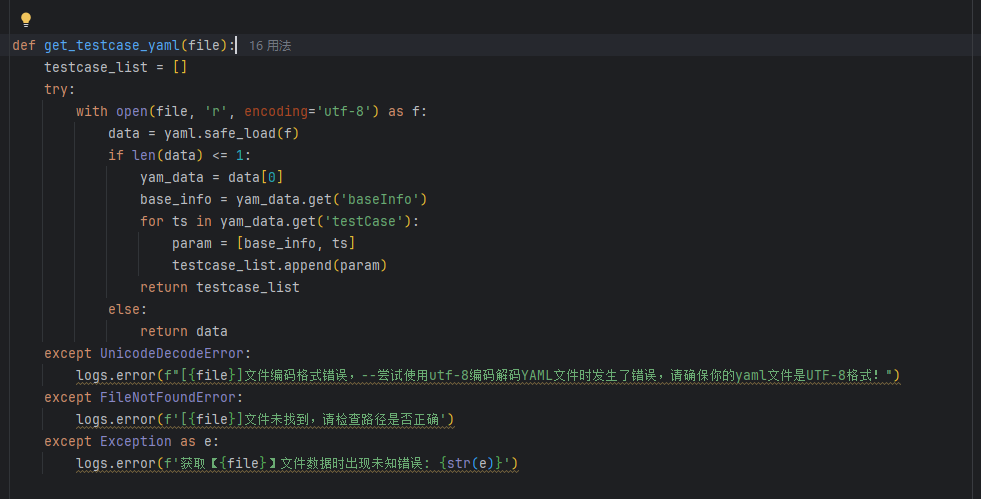
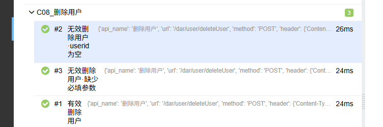
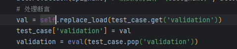

# 接口自动化项目

## 框架介绍

- base 基础类封装，测试用例工具
- common  公共方法封装
- conf  存放全局配置文件目录
- data  存放测试数据路径
- logs  存放测试日志目录
- report    测试报告生成目录，目前支持生成两种形式的报告
- testcase  存放测试用例文件目录
- venv  本框架使用的虚拟环境
- conftest.py 全局操作，名称是固定写法不可更改
- environment.xml allure测试报告总览-环境显示内容
- extract.yaml 接口依赖参数存放文件
- pytest.ini pytest框架规范约束，名称是固定写法不可更改
- requirements.txt 本框架所使用的到的第三方库
- run.py 主程序入口

**1、用例模板(baseInfo、testcase的关键字不能缺少）**

```yaml
baseInfo:
api_name: 轨迹查询
url: /monitor/vehicle/getMileageFrom
method: post
header:
  Content-Type: application/x-www-form-urlencoded;charset=UTF-8
  token: ${get_extract_data(token)}
  userid: ${get_extract_data(userid)}
cookies: //可有可无，根据项目实际情况，如果项目需要cookie则要写
  SESSION: ${get_extract_data(Cookie,SESSION)}
testCase:
  -
    case_name: 有效车牌号轨迹查询
    data:
      vno: 鲁E00098
      color: 2
      startDate: ${start_time()}
      ruleIds: ["${get_extract_data_lst(forbiddenRule,-2)}"]  #参数是列表形式的，列表内必须为字符串形式，否则读取不到
      endDate: ${end_time()}
      vehicleNo: ${get_extract_data(fatig_vahicle,randoms)}  # 参数1 是extract.yaml里面的key；参数2 randoms默认为空，若提取的值是个列表，该参数填列表取值的索引值,0随机，其他根据列表，1第一个，以此类推
    files:
      file: ./data/heimingdan.xlsx   # 注意有些导入文件接口不需要设置请求头，设置了反而会报错
    validation: # 断言验证，根据实际需求选择使用以下哪种断言方式
      - contains: {status_code: 200}     # 字符串包含断言模式，有多种断言时，contains必须在前面
      - contains: {'message':'success'}  # 字符串包含断言模式
      - contains: {'message':None}  # 字符串为空断言
      - eq: {'state': '已入网'}           # 相等断言模式，这个要在contains的下面
      - ne: {'state': '已入网'}           # 不相等断言模式
      - rv: {"data":2}                   # 断言接口返回值的任意值模式
      - db: select * from sys_user su where login_name ='test999'    #数据库断言，这里直接写SQL即可
      - contains: {'csrfToken': '${get_extract_data(Cookie,csrfToken)}' }  #因格式问题，这里面的提取表达式必须要用引号
    extract:  # 提取一个参数，支持json提取和正则表达式提取
      id: $.data
      status: '"status":"(.*?)"'
      data: '"data":(\d*)'        #提取数字  
    extract_list:  #提取多个参数，以列表形式返回，支持json提取和正则表达式提取
      id: $.result.id        
```

**关于参数提取，json提取器表达式**

可以使用这个在线jsonpath解析器：http://www.atoolbox.net/Tool.php?Id=792

**2、参数说明**

    `url`：只写接口地址，ip和端口去conf目录下的config.ini配置[api_envi]
    `参数传递: ${get_extract_data(token)}` ：参数传递格式为：${函数名(*args)}，args参数可有可无，函数实现可以去common目录下的debugtalk.py去实现具体方法

**3、接口参数类型**

参数类型主要有：params、data、json（只能填这三个其中一个，根据接口接口的请求方式、参数类型选择）
post请求：1）表单提交-->data
         2)json提交--->json
get请求：1）url传参--->params

注：参数类型一定要写对，根据你的实际接口传参类型类型，对应的header也要变更

如： data   对应的header为：  Content-Type:application/x-www-form-urlencoded;charset=UTF-8
    json   对应的header为：  Content-Type:application/json;charset=UTF-8
    files  文件提交          Content-type:multipart/form-data; charset=utf-8

**4、注意事项**

 1）首先安装本项目所需的依赖库，命令为：

```Python
pip install -r requirements.txt
```

 2）环境配置，建议使用本地的python环境，当然也可以使用项目下的venv虚拟环境，但是虚拟环境的第三方库版本和你本地的python解释器版本会有不兼容的情况，遇到哪个第三方库报错就需要卸载在重装
 配置方法请参考：https://app.yinxiang.com/fx/276ba8ce-63a6-410b-ac1f-509da376181c
 3）如果运行后有报错，那就是python第三库版本与本框架中的第三库版本冲突导致，哪个报错，你就卸载哪个然后重新安装即可
 4）本项目结构下的文件，除了data目录下的文件可以自由删除，其他文件均不可以删除，否则会报错无法运行
 5）pytest.ini文件名为固定写法不可更改，里面内容不可以加#中文注释，会报错，实在要加请参考：https://blog.51cto.com/u_15688254/5391563
 6）第三方库安装命令，使用镜像源：pip install pandas -i https://pypi.tuna.tsinghua.edu.cn/simple/
 7）环境部署常见错误请参考：https://app.yinxiang.com/fx/a74c2da8-1f76-4757-9467-5392889d0ad7

**5、如果不想自己编写接口信息yaml文件，可以运行base目录下的new_testcase_tools.py文件，打开后填入相关参数**
   可以先点击接口调试，确认接口没问题，再点击生成yaml文件

**6、allure测试报告**

1.运行根目录下的`run.py`文件

2.运行之后打开以下文件运行

`pythonproject\report\allureReport\index.html`

3.报告截图





## 框架设计

### 读yaml指定参数

其中node_name是指定参数名字

```python
 def get_extract_data(self, node_name, randoms=None) -> str:
```

randoms: int类型，0：随机读取；-1：读取全部，返回字符串形式；-2：读取全部，返回列表形式；其他根据列表索引取值，取第一个值为1，第二个为2，以此类推;

```python
 if randoms is not None and bool(re.compile(r'^[-+]?[0-9]*\.?[0-9]+([eE][-+]?[0-9]+)?$').match(randoms)):
            randoms = int(randoms)
            data_value = {
                randoms: self.get_extract_order_data(data, randoms),
                # data中随机选一个值
                0: random.choice(data),
                # 变成字符串
                -1: ','.join(data),
                # 变成字符串列表
                -2: ','.join(data).split(','),
            }
            data = data_value[randoms]
```

### yaml的参数化用例

**1.以删除用户为例**

项目目录



yaml如下


下面三行装饰器分别是allure报告名字、测试用例执行顺序为3、传递测试数据为读取yaml参数（**test_case变量**）



`def get_testcase_yaml(file):`方法实现了如何根据yaml转化为测试参数

**涵盖返回值处理、异常处理、记录日志**



allure报告的测试名字




**处理断言**



函数`def specification_yaml(self, base_info, test_case):`为**通用接口处理方法**

**仔细梳理这个方法处理接口调用流程，就可以举一反三处理其他接口了。**
